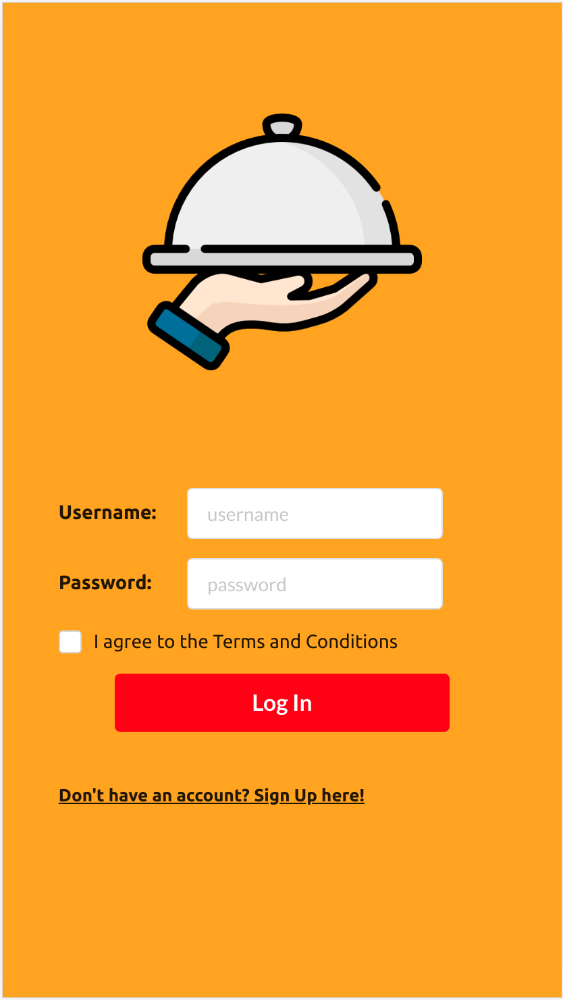
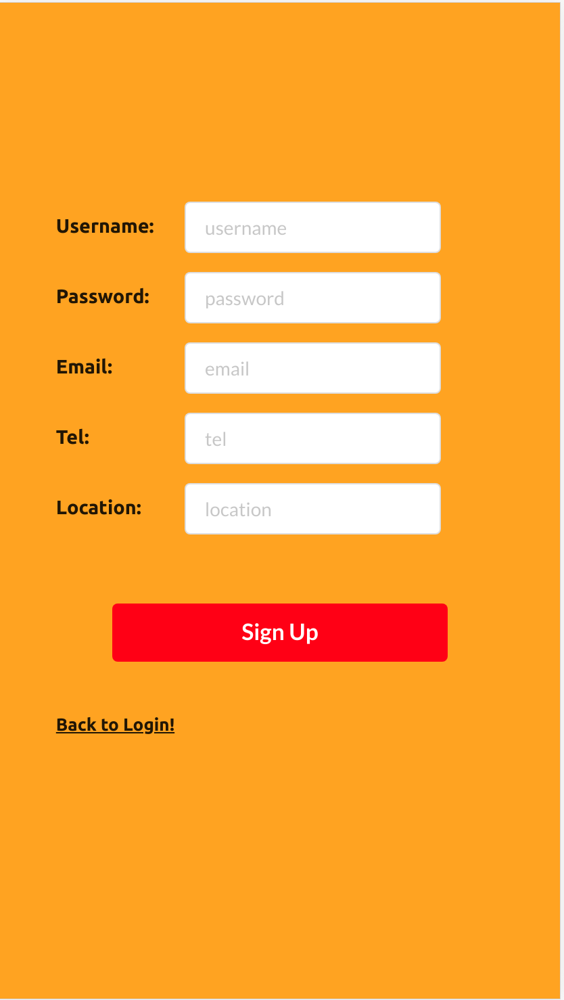
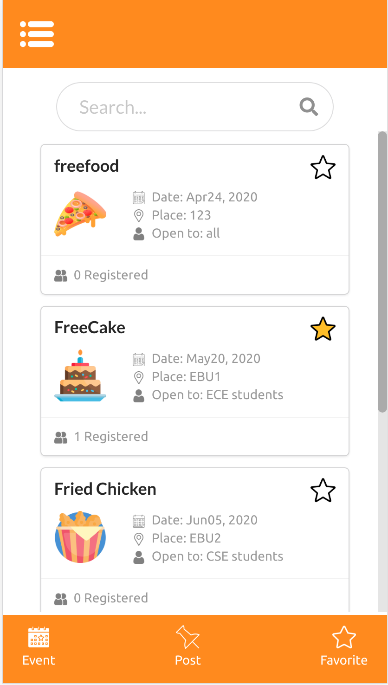
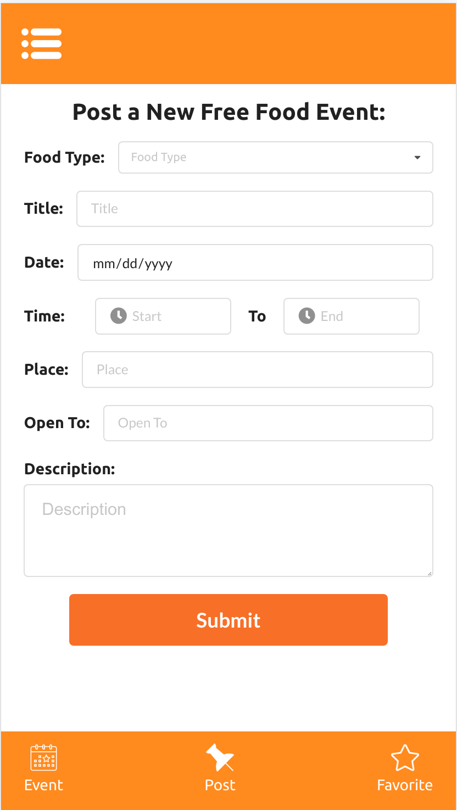
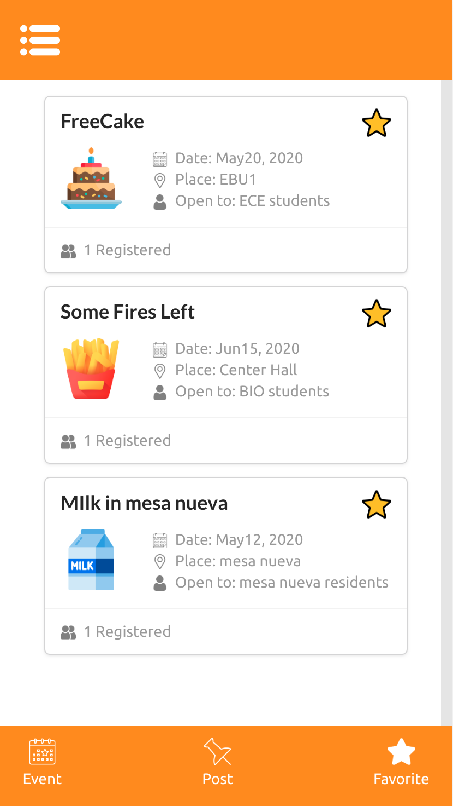
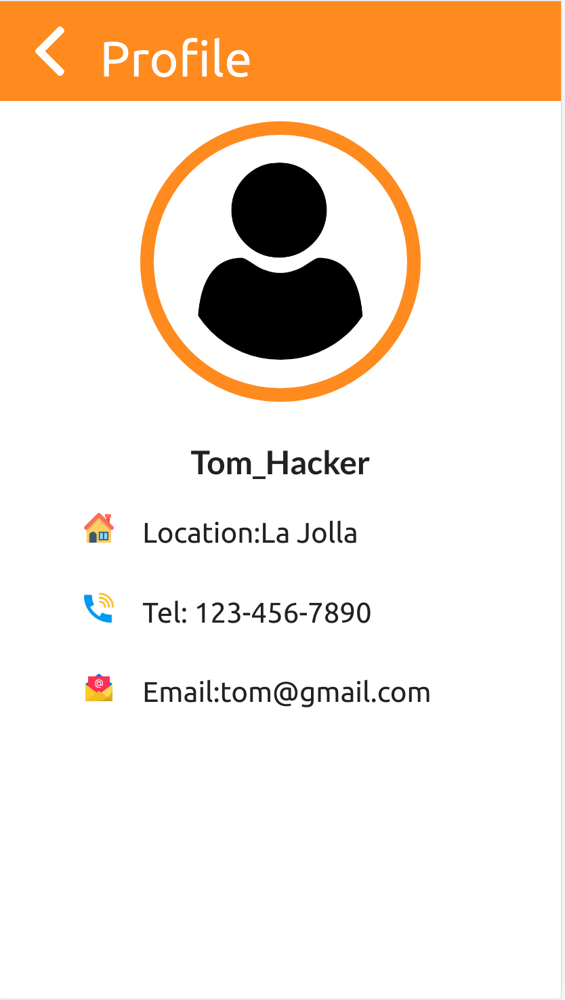
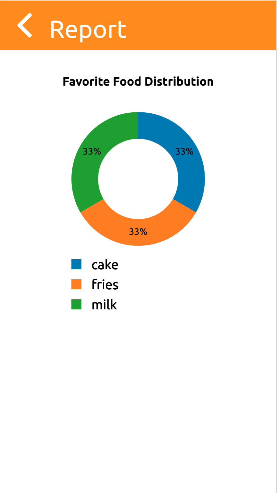

# FreeFood App
### Tech Stack:
- Front-end: HTML/CSS/JS,React/Redux,Immutable.js,Typescript, 
D3.js,semantic-ui, webpack
- Back-end: Django, MySQL
### Snapshots:
#### Login and Signup:
You can login using username:Tom_Hacker,password:efghij

or Sign up at

#### See freefood event at:

#### You can also post events yourself:

#### Your stared events are available here:

### You can see your profile here:

### You can see the distribution of your favorite food here:

